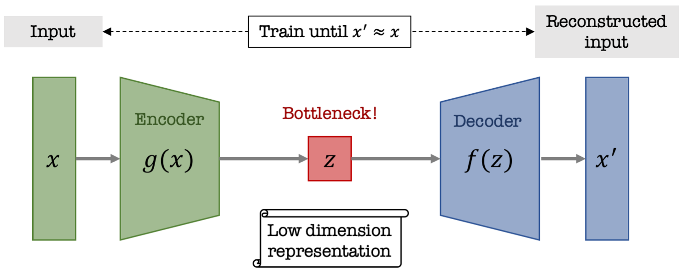
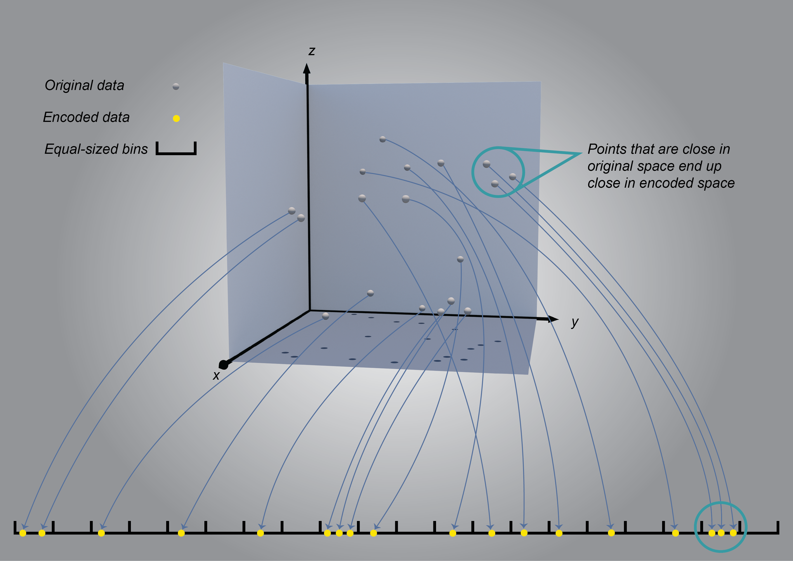

# VAEs-in-Economics
Sponsored by: [EasyAsPie.ai](http://easyaspie.ai/home)

This project aims to explore applications of Variational Auto-Encoders (VAEs) in Economics. A VAE is a type of neural network that condenses data in a way that preserves as much detail as possible. We take some data and run it through the neural network, and what we ask the network to do for us is to give us back the same data that we put in. The network we use for this task is not plain vanilla. The way it’s special is that it has a bottleneck hiding in the middle.

Once we complete training, we’re actually not going to be using the whole network. The useful part is the portion from the input to the bottleneck, and that’s it. The first portion of the trained network is all we need in order to decomplexify. The second portion of the network would be useful if we wanted to complexify.

Setting the bottleneck to just one number is the highest level of decomplexification possible. It takes the VAE to its fullest potential. That's what we're trying to do.

## Equal Sized Bins 

Using equal sized bins means that we divide the range of encoded data into a predetermined number of sections, each of equal length. These are bins in the sense that all data that gets encoded into each section is said to “fall” into that bin. We treat every piece of data that gets encoded to the same bin as being of the same type. The bins become our definition of types. Bins might not be the most sophisticated way of defining types, but they’re simple and transparent. And once you think about how a VAE actually works, you’ll realize bins aren’t such a bad idea after all.

Some areas of the encoded range have lots of people that are encoded into them. Other areas of the encoded range are sparsely populated. The advantage of equal-sized bins is that the areas that are densely populated become our common types. The areas that are sparsely populated become our rarely observed types. This appropriately corresponds to what you see in real life. There are some people whose behavior is fairly unusual. It's not so easy to put them into the same type with other people, because not many other customers share that particular pattern of time use. On the other hand, there are lots of customers who have a perfectly ordinary pattern. Many of these ordinary patterns are similar to one another, and all similar patterns will end up in either the same type or two neighboring types.

## American Time-Use Archetypes

In our first application, we're focusing on a data set called the American Time Use Survey (ATUS), a government survey conducted by the US Bureau of Labor Statistics (BLS). The respondents are asked ahead of time to write down their activities during a given 24-hour period. BLS representatives classify the activities of the respondents into 389 different categories, minute-by-minute. Every year’s survey has approximately 11,500 records. The survey is conducted on a rolling basis, so it’s representative of both the population, the days of the week, and the seasons. 

The question we’re going to ask about this incredibly intimate window into people’s lives is can we identify overarching types for describing the overwhelming diversity and baroque intricacy of how people choose to spend their day?

## Preliminary Results 

Selected plots of the resulting encoding for the 2013 ATUS data:

